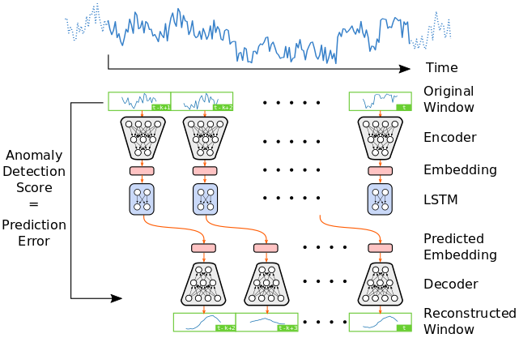
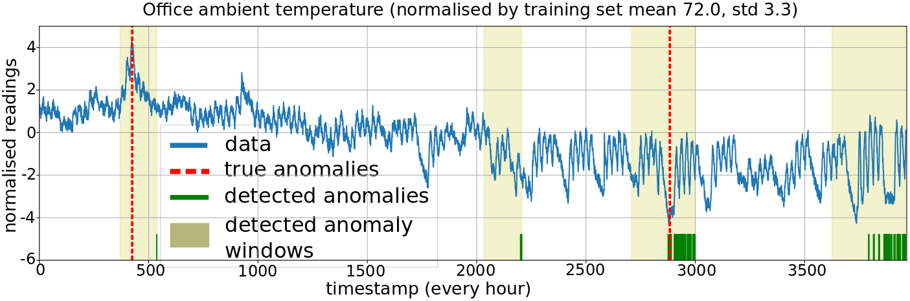

# VAE-LSTM for anomaly detection (ICASSP'20)

This Github repository hosts our code and pre-processed data to train a VAE-LSTM hybrid model for anomaly detection, as proposed in our paper: <br><br>
[Anomaly Detection for Time Series Using VAE-LSTM Hybrid Model](https://ieeexplore.ieee.org/document/9053558). 
<br>
[Shuyu Lin<sup>1</sup>](https://shuyulin.co.uk/), [Ronald Clark<sup>2</sup>](http://www.ronnieclark.co.uk), Robert Birke<sup>3</sup>, Sandro Schönborn<sup>3</sup>, Niki Trigoni<sup>1</sup>, [Stephen Roberts<sup>1</sup>](https://www.robots.ox.ac.uk/~sjrob/)
<br>
<sup>1</sup>University of Oxford, <sup>2</sup>Imperial College London, <sup>3</sup>ABB Corporate Research

In short, our anomaly detection model contains:
  * a VAE unit which summarizes the local information of a short window into a low-dimensional embedding,
  * a LSTM model, which acts on the low- dimensional embeddings produced by the VAE model, to manage the sequential patterns over longer term.

An overview of our model is shown below:




An example of anomaly detection on a time series of office temperature, which is provided by Numenta anomaly benchmark (NAB) datasets in their known anomaly subgroup [link](https://github.com/numenta/NAB/tree/master/data/realKnownCause):




To run our code, please follow the instructions shown below. 

## Environment
Our code is written in Python3 with tensorflow 1.5 library.
Please install the python libraries listed in the requirements.txt. We suggest to build a virtual environment using virtualenv package. To install and set up virtualenv, please follwo the procedures [here](https://packaging.python.org/guides/installing-using-pip-and-virtual-environments/).

## Data pre-processing
We pre-processed the NAB data, which consists of 5 sequences, by creating a training set that does not contain any anomalies while keeping the rest of sequence as test set for evaluation. In addition, we removed the mean and standardized the time series. Pre-processed data are included in the `datasets/` subfolder with this repository for convenience of running our code. A demo ipython notebook has also been provided in `datasets/` to show how the pre-processing is done. Explanation of the different features saved in the .npz files for the pre-processed datasets are given in the [discussion](https://github.com/lin-shuyu/VAE-LSTM-for-anomaly-detection/issues/3). 

If you want to use the data for your own project, please cite and refer to the [NAB project](https://numenta.com/machine-intelligence-technology/numenta-anomaly-benchmark/) and access the raw data if needed. 

## Training
Our VAE-LSTM model is defined in several files in the `codes/` subfolder, including train.py, base.py, utils.py, data_loader.py, models.py, trainers.py. To train our model, simply run 
`python3 train.py --config NAB_config.json`, 
where NAB_config.json defines all the hyper-parameters of our model and you can experiment by using different values. 

## Anomaly detection using the trained model
After the model has been trained, we also prepare an iPython-notebook in NAB-anomaly-detection.ipynb for you to detect some anomalies detection on the test set. All you need to do is to run the code, make sure the NAB_config.json is prepared so that the right trained model will be loaded. The only thing that you need to specify in order to achieve reasonable anomaly detection result is to set a threshold on the anomaly detection metric. We suggest to observe the histogram of the anomaly detection metric and set the threshold accordingly.

Hope you enjoy playing with our code and find it helpful for your projects! Happy anomaly detection! 

If you find our codes/project relevant to your work, please cite us in your work:

```
@INPROCEEDINGS{VAE-LSTM-AD, 
   author={S. {Lin} and R. {Clark} and R. {Birke} and S. {Schönborn} and N. {Trigoni} and S. {Roberts}}, 
   booktitle={ICASSP 2020 - 2020 IEEE International Conference on Acoustics, Speech and Signal Processing (ICASSP)}, 
   title={Anomaly Detection for Time Series Using VAE-LSTM Hybrid Model}, 
   year={2020}} 
```
